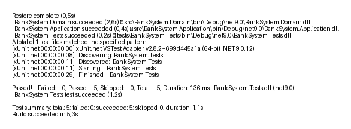

# BankSystem — Lab 34

Базова консольна система управління банківськими рахунками для Lab 34.

Проєкт демонструє архітектуру baseline з простою бізнес-логікою та мінімальною persistence-компонентою.

---

## Реалізовані можливості

- Багатошарова архітектура:
  - Domain
  - Application
  - Infrastructure
  - Console UI
  - Tests
- Persistence через JSON
- Repository pattern
- Dependency Injection
- Unit tests та integration tests
- Fault handling
- Coverage
- CI через GitHub Actions
- UML та ER diagrams
- Release documentation

---

## Структура проєкту

- `src/`
- `tests/`
- `docs/`
- `.github/workflows/`

---

## Запуск

### Збірка

```bash
dotnet build
```

### Запуск програми

```bash
dotnet run --project src/BankSystem.Console
```

### Запуск тестів

```bash
dotnet test
```

---

## Coverage

```bash
dotnet test /p:CollectCoverage=true /p:CoverletOutputFormat=opencover
```

---

## CI

GitHub Actions автоматично:
- restore
- build
- test
- coverage

---

## Результат запуску тестів



