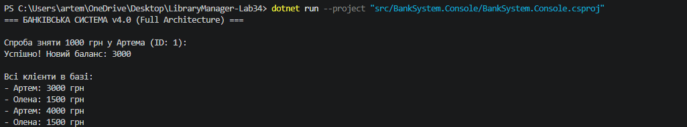

# BankSystem 

BankSystem — консольна банківська система, розроблена в рамках лабораторних робіт №34–35 з дисципліни «Об’єктно-орієнтоване програмування».

–ü—Ä–æ—î–∫—Ç —Ä–µ–∞–ª—ñ–∑—É—î –±–∞–≥–∞—Ç–æ—à–∞—Ä–æ–≤—É –∞—Ä—Ö—ñ—Ç–µ–∫—Ç—É—Ä—É, –±—ñ–∑–Ω–µ—Å-–ª–æ–≥—ñ–∫—É –±–∞–Ω–∫—ñ–≤—Å—å–∫–∏—Ö –æ–ø–µ—Ä–∞—Ü—ñ–π, –∞—Å–∏–Ω—Ö—Ä–æ–Ω–Ω–µ –∑–±–µ—Ä–µ–∂–µ–Ω–Ω—è –¥–∞–Ω–∏—Ö —É JSON —Ç–∞ –∞–Ω–∞–ª—ñ—Ç–∏—á–Ω—ñ LINQ-–∑–∞–ø–∏—Ç–∏.

---

#  –û—Å–Ω–æ–≤–Ω—ñ –º–æ–∂–ª–∏–≤–æ—Å—Ç—ñ

## –Ü—Ç–µ—Ä–∞—Ü—ñ—è 1 (Lab 34)

- –°—Ç–≤–æ—Ä–µ–Ω–Ω—è –±–∞–Ω–∫—ñ–≤—Å—å–∫–∏—Ö —Ä–∞—Ö—É–Ω–∫—ñ–≤
- –ü–æ–ø–æ–≤–Ω–µ–Ω–Ω—è —Ä–∞—Ö—É–Ω–∫—É
- –ó–Ω—è—Ç—Ç—è –∫–æ—à—Ç—ñ–≤
- –ü–µ—Ä–µ–∫–∞–∑ –º—ñ–∂ —Ä–∞—Ö—É–Ω–∫–∞–º–∏
- –ó–±–µ—Ä–µ–∂–µ–Ω–Ω—è —Ç—Ä–∞–Ω–∑–∞–∫—Ü—ñ–π
- –ö–æ–Ω—Å–æ–ª—å–Ω–∏–π —ñ–Ω—Ç–µ—Ä—Ñ–µ–π—Å
- Unit-—Ç–µ—Å—Ç–∏ –±–∞–∑–æ–≤–æ—ó –ª–æ–≥—ñ–∫–∏

---

## –Ü—Ç–µ—Ä–∞—Ü—ñ—è 2 (Lab 35)

### –ë—ñ–∑–Ω–µ—Å-–ø—Ä–∞–≤–∏–ª–∞
- Баланс рахунку не може бути від’ємним
- –°—É–º–∞ —Ç—Ä–∞–Ω–∑–∞–∫—Ü—ñ—ó –ø–æ–≤–∏–Ω–Ω–∞ –±—É—Ç–∏ –±—ñ–ª—å—à–æ—é –∑–∞ 0
- Добовий ліміт на зняття коштів — 20 000 грн
- –ù–æ–º–µ—Ä IBAN —î —É–Ω—ñ–∫–∞–ª—å–Ω–∏–º
- –ö–æ–º—ñ—Å—ñ—è –∑–∞–ª–µ–∂–∏—Ç—å –≤—ñ–¥ —Ç–∏–ø—É –∫–ª—ñ—î–Ω—Ç–∞

### Persistence Layer
- –ê—Å–∏–Ω—Ö—Ä–æ–Ω–Ω–µ –∑–±–µ—Ä–µ–∂–µ–Ω–Ω—è –¥–∞–Ω–∏—Ö —É JSON
- –ó–∞–≤–∞–Ω—Ç–∞–∂–µ–Ω–Ω—è —Ä–∞—Ö—É–Ω–∫—ñ–≤ –ø—Ä–∏ —Å—Ç–∞—Ä—Ç—ñ –ø—Ä–æ–≥—Ä–∞–º–∏
- –ó–±–µ—Ä–µ–∂–µ–Ω–Ω—è —ñ—Å—Ç–æ—Ä—ñ—ó —Ç—Ä–∞–Ω–∑–∞–∫—Ü—ñ–π

### Strategy Pattern
–†–µ–∞–ª—ñ–∑–æ–≤–∞–Ω–æ Strategy Pattern –¥–ª—è –æ–±—á–∏—Å–ª–µ–Ω–Ω—è –∫–æ–º—ñ—Å—ñ–π:
- StandardFeeStrategy
- PremiumFeeStrategy

### LINQ –ê–Ω–∞–ª—ñ—Ç–∏–∫–∞
- –¢–æ–ø —Ç—Ä–∞–Ω–∑–∞–∫—Ü—ñ–π
- –ì—Ä—É–ø—É–≤–∞–Ω–Ω—è –æ–ø–µ—Ä–∞—Ü—ñ–π
- –ü–æ—à—É–∫ –Ω–µ–∞–∫—Ç–∏–≤–Ω–∏—Ö —Ä–∞—Ö—É–Ω–∫—ñ–≤
- –ü—ñ–¥—Ä–∞—Ö—É–Ω–æ–∫ –∑–∞–≥–∞–ª—å–Ω–æ–≥–æ –±–∞–ª–∞–Ω—Å—É

---

#  –ê—Ä—Ö—ñ—Ç–µ–∫—Ç—É—Ä–∞

## BankSystem.Domain
–ú—ñ—Å—Ç–∏—Ç—å:
- Account
- Transaction
- IRepository
- –¥–æ–º–µ–Ω–Ω—ñ –ø—Ä–∞–≤–∏–ª–∞

## BankSystem.Application
–ú—ñ—Å—Ç–∏—Ç—å:
- BankService
- –±—ñ–∑–Ω–µ—Å-–ª–æ–≥—ñ–∫—É
- –ø–µ—Ä–µ–≤—ñ—Ä–∫–∏ —Ç–∞ –≤–∞–ª—ñ–¥–∞—Ü—ñ—é

## BankSystem.Infrastructure
–ú—ñ—Å—Ç–∏—Ç—å:
- JsonRepository
- —Ä–æ–±–æ—Ç—É –∑ JSON
- persistence layer

## BankSystem.Console
–ö–æ–Ω—Å–æ–ª—å–Ω–∏–π —ñ–Ω—Ç–µ—Ä—Ñ–µ–π—Å –∫–æ—Ä–∏—Å—Ç—É–≤–∞—á–∞.

## Tests
Unit-—Ç–µ—Å—Ç–∏ –¥–ª—è –ø–µ—Ä–µ–≤—ñ—Ä–∫–∏ –±—ñ–∑–Ω–µ—Å-–ª–æ–≥—ñ–∫–∏.

---

#  –ó–∞–ø—É—Å–∫ –ø—Ä–æ—î–∫—Ç—É

## –í–∏–º–æ–≥–∏
- .NET 9 SDK

---

## –ó–±—ñ—Ä–∫–∞ –ø—Ä–æ—î–∫—Ç—É

```bash
dotnet build

#  –ó–∞–ø—É—Å–∫ —é–Ω—ñ—Ç —Ç–∫—Å—Ç—ñ–≤

## À‡·Ó‡ÚÓ̇ Ó·ÓÚ‡ 35

## À‡·Ó‡ÚÓ̇ Ó·ÓÚ‡ 35
