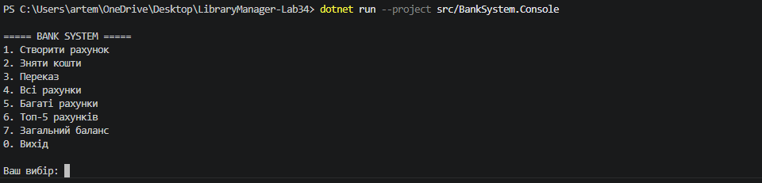
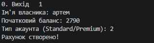
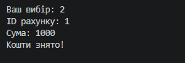
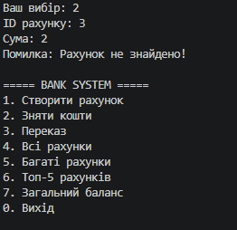

# DEMO — BankSystem

# Мета демонстрації

Показати:
- архітектуру проєкту;
- основну функціональність;
- persistence;
- тестування;
- обробку помилок.

Тривалість демонстрації: 3–5 хвилин.

---

# 1. Старт застосунку

Запуск:

```bash
dotnet run --project src/BankSystem.Console
```

Пояснити:
- структуру проєкту;
- Clean Architecture;
- поділ на шари.

---

# 2. Основний сценарій

## Створення акаунта

Показати:
- створення нового акаунта;

- введення власника;
- початковий баланс.

---

## Поповнення балансу

Показати:
- вибір акаунта;
- внесення коштів;
- оновлення балансу.

---

## Зняття коштів

Показати:
- fee strategy;
- зміну балансу;
- валідацію операції.


---

# 3. Негативний сценарій

Показати:
- спробу зняти більше коштів, ніж є на балансі;
- обробку помилки;
- повідомлення користувачу.

---

# 4. Persistence

Показати:
- JSON-файл;
- збереження даних;
- повторний запуск застосунку;
- відновлення акаунтів.

---

# 5. Тестування

Запуск тестів:

```bash
dotnet test
```

Показати:
- успішне проходження тестів;
- кількість тестів;
- coverage report.

---

# 6. Coverage Report

Запуск:

```bash
start coverage-report/index.html
```

Показати:
- line coverage;
- branch coverage;
- покриття основних компонентів.

---

# 7. Архітектурні рішення

Пояснити:
- SOLID;
- Strategy Pattern;
- Generic Repository;
- persistence layer;
- separation of concerns.

---

# 8. Завершення

Підсумувати:
- проєкт стабільний;
- тестування пройдено;
- архітектура масштабована;
- система готова до релізу v1.0.0.