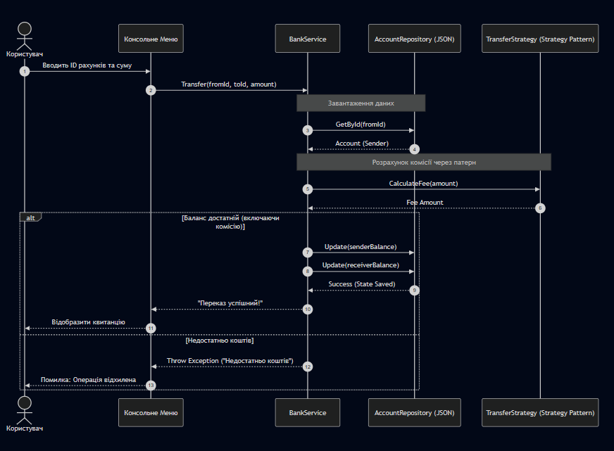

---

# `docs/UML.md`

```md
# UML — BankSystem

## Основні сутності

### Account
Представляє банківський рахунок.

Містить:
- IBAN
- Balance
- OwnerName

---

### Transaction
Представляє фінансову операцію.

Містить:
- FromAccount
- ToAccount
- Amount
- Date

---

### BankService
Містить бізнес-логіку системи.

Відповідає за:
- перекази;
- перевірки;
- валідацію.

---

### JsonRepository
Відповідає за:
- збереження;
- завантаження;
- роботу з JSON.

---

# Strategy Pattern

## IFeeStrategy
Інтерфейс для обчислення комісії.

---

## StandardFeeStrategy
Стандартна комісія:
- 1%.

---

## PremiumFeeStrategy
Premium-комісія:
- 0%.

---

# Архітектура

Система побудована за принципами:
- Clean Architecture;
- Separation of Concerns;
- SOLID.