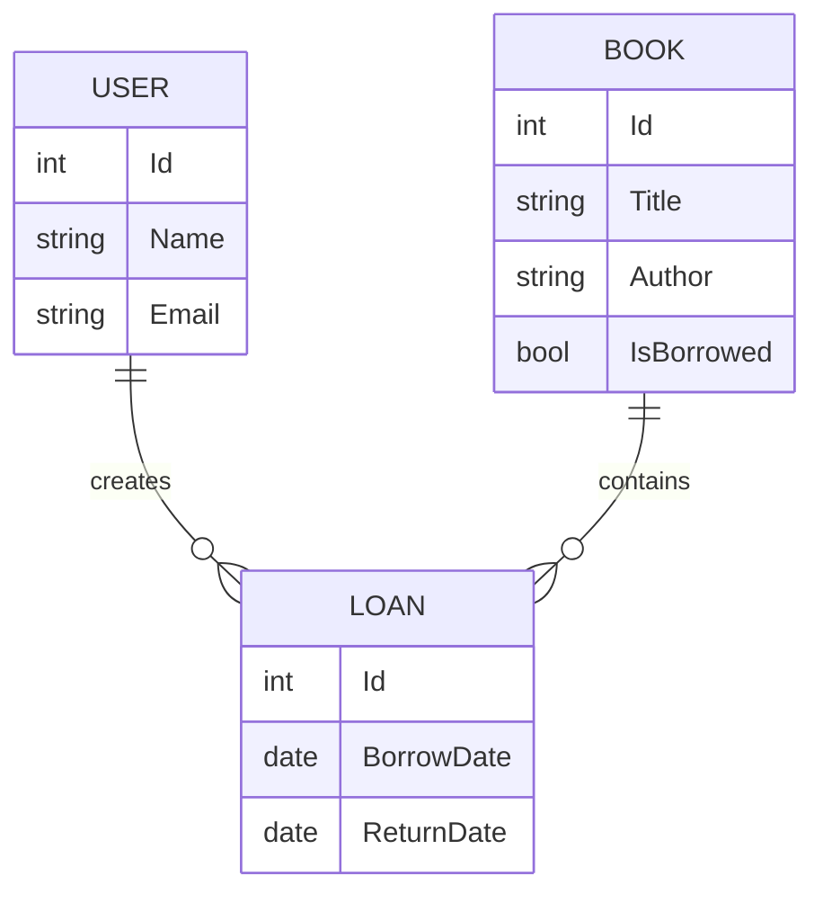

# ER Diagram — LibraryManager

```mermaid
erDiagram
    BOOK {
        int Id
        string Title
        string Author
        bool IsBorrowed
    }

    USER {
        int Id
        string Name
        string Email
    }

    LOAN {
        int Id
        date BorrowDate
        date ReturnDate
    }

    USER ||--o{ LOAN : creates
    BOOK ||--o{ LOAN : contains
```
